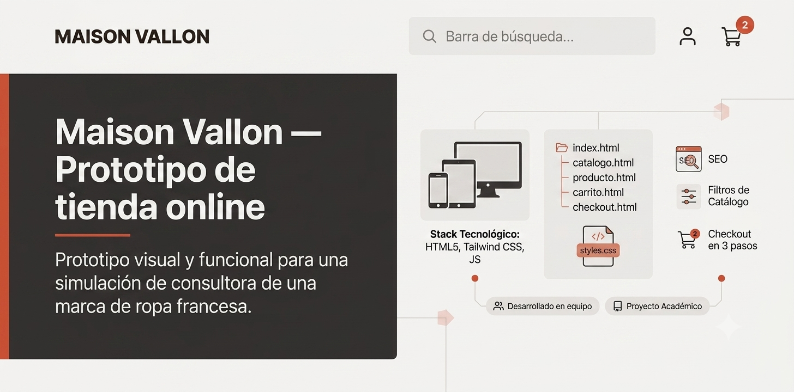

# Maison Vallon — Prototipo de tienda online



Prototipo visual y funcional de e-commerce desarrollado como simulación de proyecto de consultora para una marca de ropa con sede en Francia. El objetivo es validar con el cliente el diseño, la navegación y la experiencia de compra antes de pasar a desarrollo completo.

## 📋 Descripción

El cliente solicitó un prototipo de tienda online con **5 vistas principales**, cuidando SEO, diseño moderno y consistente, y una experiencia totalmente responsive (móvil, tablet y escritorio).

## 🖥️ Vistas del prototipo

| Vista | Descripción | Estado |
|---|---|---|
| **Home** | Navbar, hero de campaña, listados de "Nuevos lanzamientos" y "Más vendidos", footer | ✅ |
| **Catálogo** | Listado de productos en grid con filtros por categoría y talla | 🔄 |
| **Vista de producto** | Ficha de producto a dos columnas (imagen + info) con descripción detallada | 🔄 |
| **Carrito** | Vista completa con productos añadidos y resumen de totales | 🔄 |
| **Checkout** | Formulario de pago en 3 pasos (datos personales, dirección, tarjeta) | 🔄 |

## 🎨 Diseño

- Diseño moderno y minimalista, con acentos en color terracota sobre base clara
- Navbar y footer comunes a todas las vistas, para mantener coherencia visual en todo el sitio
- Sistema de diseño (colores, tipografía, espaciados) centralizado en `styles.css` para que cualquier vista nueva se integre sin desajustes

## 🛠️ Stack tecnológico

- **HTML5 semántico** — estructura accesible y orientada a SEO (`header`, `nav`, `main`, `section`, `article`, `footer`)
- **Tailwind CSS** — utilidades para maquetación y responsive
- **CSS** (`styles.css`) — variables y estilos genéricos compartidos entre vistas

## 📁 Estructura del proyecto

```
├── index.html          # Home
├── catalogo.html        # Catálogo
├── producto.html         # Vista de producto
├── carrito.html          # Carrito
├── checkout.html          # Checkout (3 pasos)
├── styles.css            # Estilos y design tokens compartidos
└── assets/                # Imágenes e iconos
```

## ✅ Requisitos cubiertos

- [x] Estructura HTML5 semántica
- [x] SEO on-page (jerarquía de encabezados, meta tags, alt en imágenes)
- [x] Diseño responsive (móvil / tablet / escritorio)
- [x] Navbar y footer reutilizables en todas las vistas
- [ ] Las 5 vistas completas e integradas

## 🚀 Cómo verlo en local

Es un prototipo estático, sin build ni dependencias que instalar:

1. Clona el repositorio
2. Abre `index.html` en el navegador, o sírvelo con una extensión tipo *Live Server* en VS Code para navegar entre las vistas

## 👥 Equipo

Proyecto desarrollado en equipo dentro de una consultora simulada:

- **Home, navbar y footer** — [@AlbertoBeCi](https://github.com/AlbertoBeCi)
- **Catálogo** — [@christiansquitieri1999](https://github.com/christiansquitieri1999)
- **Producto** — [@luisArrieta](https://github.com/luisArrieta)
- **Carrito y checkout** — compañero/a de equipo

## 📄 Licencia

Proyecto académico con fines educativos.